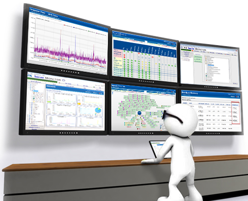

# Monitor-System

The SYSTEM Monitor utility allows you to accurately view the usage of CPU, memory, hard drive, and network connection. 
 
## Caracéristiques implémentées
With this Monitor, you can view this stats : 
 - Usage, Frequency and processor temperature
 - Ram : total, used, free, cached, buffer
 - Disk Usage "READ/WRITE"
 - Help & organisation of arguments
 - Socket send/recv

if you need a help : after compiling
```
./aise -h or ./aise -help
```

## Building
```
git clone https://github.com/Lounes-Kheris/Monitor-System.git
cd Monitor-System
cd build
cmake ..
make
```
If you want to execute this prog in you're terminal
```
./aise -local
```
Then click on 'q' or 'Q'
--------------------------------------------------------------
If you want to execute in distance
1- Open server 
```
gcc server.c -o server | ./server
```
after 
```
./aise -send

```
Then click on 'q' or 'Q'
## Intalling 
after building the project Monitor-System, you can install it 
```
sudo make install
```
 
